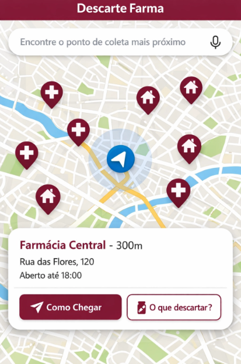

# Descarte Farma

## ♻️ Descarte Consciente, Futuro Saudável

### Problema

O descarte inadequado de medicamentos vencidos ou sobras de tratamento é um problema ambiental e de saúde pública crescente. Quando jogados no lixo comum ou na rede de esgoto, esses produtos contaminam o solo e a água, afetando ecossistemas e a saúde humana. A falta de informação e acessibilidade a pontos de coleta corretos contribui significativamente para essa prática prejudicial.

### Solução: Aplicativo Descarte Farma

O **Descarte Farma** é um aplicativo móvel inovador que visa solucionar o problema do descarte incorreto de medicamentos. Utilizando a tecnologia de geolocalização (GPS) e integração com visualização de 360° (similar ao Street View), o aplicativo permite que os usuários encontrem facilmente os pontos de coleta mais próximos e adequados para medicamentos vencidos ou não utilizados, como farmácias e postos de saúde que participam do programa de descarte consciente, e ainda visualizem o local antes de se deslocarem.

### Funcionalidades Principais

*   **Localização por GPS**: Identifica e exibe em um mapa os pontos de coleta mais próximos do usuário.
*   **Visualização 360°**: Permite ao usuário explorar o entorno do ponto de coleta (farmácia, posto de saúde, hospital) com uma visão de 360°, facilitando a identificação visual do local antes da chegada.
*   **Informações Detalhadas**: Fornece dados como endereço, horário de funcionamento, tipo de estabelecimento e uma lista clara do que pode ser descartado no local.
*   **Rotas Integradas**: Oferece a opção de traçar rotas diretas para o ponto de coleta selecionado, com direcionamento passo a passo.
*   **Guia Rápido de Descarte**: Um módulo informativo que orienta o usuário sobre quais tipos de medicamentos podem ser descartados e como prepará-los para a coleta, garantindo a segurança e a eficácia do processo.
*   **Interface Intuitiva**: Design moderno e amigável, com uma paleta de cores elegante (vermelho vinho e branco), para uma experiência de usuário fluida e eficiente.

### Impacto

O **Descarte Farma** tem um impacto multifacetado:

*   **Proteção Ambiental**: Reduz a contaminação do solo e da água por substâncias químicas presentes em medicamentos.
*   **Saúde Pública**: Minimiza os riscos de intoxicação e automedicação indevida, além de evitar a proliferação de bactérias resistentes.
*   **Educação e Conscientização**: Informa e engaja a população sobre a importância do descarte correto e seus benefícios.
*   **Facilitação da Ação Correta**: Torna o processo de descarte adequado mais acessível e conveniente para todos.

### Design da Interface

A interface do aplicativo foi projetada para ser clara, moderna e fácil de usar, com um mapa centralizado e informações de pontos de coleta acessíveis. A paleta de cores principal utiliza tons de vermelho vinho e branco, conferindo um visual sofisticado e distinto.

### Telas do Aplicativo

#### Tela de Navegação Principal

Esta tela exibe o mapa com a localização do usuário e os pontos de coleta próximos, permitindo uma visualização rápida e intuitiva. O design foi atualizado para refletir a paleta de cores vinho e branco.

#### Tela de Detalhes do Ponto de Coleta

Ao selecionar um ponto de coleta, esta tela oferece uma visão detalhada do local, incluindo a funcionalidade de visualização 360° (similar ao Street View) para auxiliar na identificação visual. As informações de descarte e opções de rota também estão presentes.

#### Guia Rápido de Descarte

Esta tela apresenta um guia conciso e visualmente organizado sobre como descartar diferentes tipos de medicamentos, garantindo que o usuário tenha acesso rápido às informações corretas.

### Como Contribuir

Interessado em fazer parte desta iniciativa? Sinta-se à vontade para:

*   Abrir `issues` para relatar bugs ou sugerir melhorias.
*   Enviar `pull requests` com novas funcionalidades ou correções.
*   Compartilhar a ideia e ajudar a conscientizar mais pessoas.

### Direitos Autorais e Propriedade Intelectual

Este projeto, incluindo seu conceito, funcionalidades e design de interface, é de propriedade exclusiva do autor. **Todos os direitos são reservados.**

A reprodução, distribuição, modificação ou uso comercial de qualquer parte deste projeto sem a autorização prévia e expressa do autor é estritamente proibida. O conteúdo deste repositório serve apenas para fins de demonstração e 
